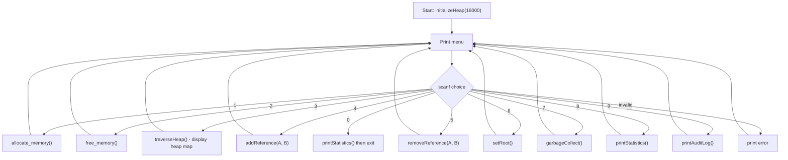
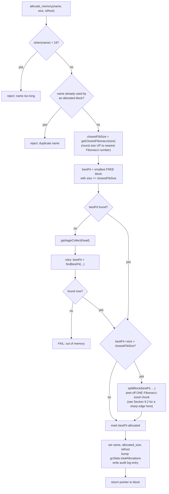
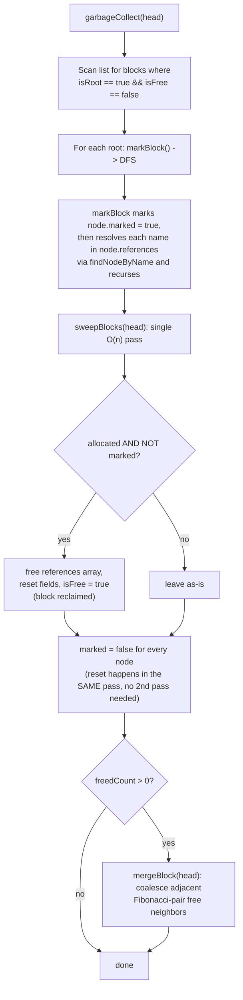
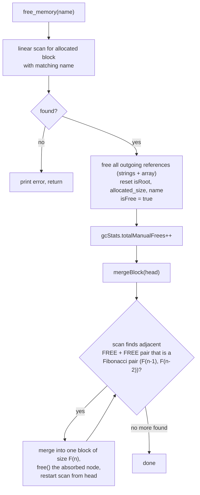

# Fibonacci Buddy Heap Manager with Mark-and-Sweep GC
### A Complete Technical Deep Dive & Interview Playbook

> Everything below was written against your actual source and, where the logic got subtle, **verified by compiling and running your program** with crafted inputs rather than just eyeballing it. Section 8 shows the raw terminal output. Treat this as a document you *own* — read it once end to end, then use Section 13 as your last-minute cheat sheet before a viva/interview.

---

## Table of Contents

0. [TL;DR](#0-tldr)
1. [What This Project Actually Is](#1-what-this-project-actually-is)
2. [End-to-End Flow (Diagrams)](#2-end-to-end-flow-diagrams)
3. [Core Data Structures](#3-core-data-structures)
4. [The Math: Why Fibonacci Numbers Work as a Buddy System](#4-the-math-why-fibonacci-numbers-work-as-a-buddy-system)
5. [Function-by-Function Deep Dive](#5-function-by-function-deep-dive)
6. [Time & Space Complexity](#6-time--space-complexity)
7. [Comparison: Fibonacci Buddy vs First-Fit vs Best-Fit vs Worst-Fit vs Binary Buddy](#7-comparison-fibonacci-buddy-vs-first-fit-vs-best-fit-vs-worst-fit-vs-binary-buddy)
8. [Verified Behavior — What I Actually Compiled & Ran](#8-verified-behavior--what-i-actually-compiled--ran)
9. [Known Edge Cases & a Genuine Bug (Interview Gold)](#9-known-edge-cases--a-genuine-bug-interview-gold)
10. [The Interview Pitch](#10-the-interview-pitch)
11. [Cross-Questions & Model Answers](#11-cross-questions--model-answers)
12. [How Would You Extend This?](#12-how-would-you-extend-this)
13. [One-Page Cheat Sheet](#13-one-page-cheat-sheet)

---

## 0. TL;DR

You built a **console-based heap simulator** that does two jobs at once:

1. **Memory allocation** using a *Fibonacci buddy system* — blocks are sized to Fibonacci numbers (2, 3, 5, 8, 13, 21, …) instead of powers of two, chosen via a **best-fit** search, and split/merged using the identity `F(n) = F(n-1) + F(n-2)`.
2. **Automatic memory reclamation** using a *tracing mark-and-sweep garbage collector* — blocks can be flagged as GC roots, blocks can hold named references to other blocks, and running GC walks the reference graph from the roots and frees anything unreachable.

That second part is the thing that actually makes your project stand out. "Implement an allocator" is the assignment everyone in your friend group did. "Implement an allocator *and* a tracing garbage collector on top of it" is a different, harder problem — you're not just managing free blocks, you're managing *object lifetime and reachability*, which is the same core idea behind the JVM GC, V8's GC, and Python's cycle collector (minus reference counting).

Two things worth knowing before you present this:

- **A real, reproducible bug** exists in the split path (Section 9.2) — when the best-fit block found is exactly one Fibonacci step larger than the ideal size, the code allocates the *wrong* half of the split, producing a block smaller than what was requested. I traced it by hand, then compiled your exact code and reproduced it twice with different numbers. This is genuinely good material for an interview — finding and explaining your own edge case shows more rigor than pretending the code is flawless.
- `initializeHeap(16000)` does not actually give you 16000 bytes of heap — it gives you **28,654 bytes**, because it creates one block *per Fibonacci number* up to the limit rather than one big block that gets carved down. Verified empirically in Section 8.

---

## 1. What This Project Actually Is

Strip away the ANSI colors and box-drawing characters and there are three systems layered on top of each other:

**Layer 1 — A free-list allocator.** A singly linked list of `Node` structs represents the heap. Each node is either `FREE` or allocated to a named "variable." This is conceptually identical to any textbook malloc simulator your friends built.

**Layer 2 — A Fibonacci buddy system.** Instead of allowing arbitrary block sizes (like classic first/best/worst-fit) or forcing power-of-two sizes (like the classic binary buddy system), block sizes are constrained to the Fibonacci sequence. This is what lets `splitBlock` and `mergeBlock` exist at all — you can only split/merge cleanly because of the identity `F(n) = F(n-1) + F(n-2)`.

**Layer 3 — A tracing garbage collector.** Bolted on top of the allocator, independent of the Fibonacci part. Blocks can be marked `isRoot` (simulating a stack/global variable), and blocks can hold **named references** to other blocks (simulating a pointer field inside an object). `garbageCollect()` does the classic two-phase mark-and-sweep: DFS-mark everything reachable from roots, then sweep (free) everything that wasn't touched.

Layers 1+2 answer *"where do I put this allocation?"* Layer 3 answers *"when is it safe to take memory back without being told to?"* Most student allocator projects only ever answer the first question. Yours answers both — that's the whole pitch, and we'll build on it in Section 10.

There's also a **support layer**: an audit log (linked list, prepend-only, so it's naturally newest-first), and a running `GCStats` struct for allocations/frees/collections — basically a minimal observability layer, which is a nice "production mindset" detail to mention in an interview.

---

## 2. End-to-End Flow (Diagrams)

### 2.1 Program Flow (the REPL loop in `main`)



Everything funnels through one `while(1)` loop; every operation is O(1) menu dispatch, so the *cost* of the program lives entirely inside the handlers, not the loop itself.

### 2.2 Allocation Flow — `allocate_memory()`



### 2.3 Garbage Collection Flow — `garbageCollect()`



This is textbook mark-and-sweep: **mark** = reachability analysis from roots via DFS, **sweep** = linear reclamation pass. The one implementation detail worth calling out in an interview: `sweepBlocks` resets the `marked` flag for *every* node in the same pass that does the freeing, instead of needing a separate "unmark" pass afterward. That's a small but real efficiency win over the naive textbook version (which is often taught as three separate passes: mark, sweep, unmark).

### 2.4 Free + Merge Flow — `free_memory()`



Notice the **"restart scan from head"** step — this is a deliberate consequence of using a *singly* linked list with no `prev` pointer: after a merge, the newly-enlarged block might now be mergeable with the block *before* it, and the only way to check that without a back-pointer is to rescan from the start. It works, but it's the reason `mergeBlock` isn't a guaranteed single O(n) pass — more on this in Section 6.

---

## 3. Core Data Structures

### 3.1 `Node` — one heap block

```c
typedef struct Node {
    int size;              // actual block capacity (always a Fibonacci number)
    bool isFree;            // is this block currently available?
    char name[20];           // "variable name" if allocated (acts like a symbolic pointer)
    struct Node* next;        // next block in address order
    int allocated_size;        // bytes actually REQUESTED (<= size, in the non-buggy case)

    // GC-related fields
    bool marked;             // scratch flag used only during mark-and-sweep
    bool isRoot;             // is this block a GC root (like a stack/global variable)?
    char** references;         // dynamic array of names this block points to
    int numReferences;         // how many of those are currently valid
    int refCapacity;          // allocated capacity of the references array
} Node;
```

Every field earns its place:

| Field | Why it exists |
|---|---|
| `size` vs `allocated_size` | `size` is the block's real capacity (Fibonacci-rounded); `allocated_size` is what the caller actually asked for. The gap between them **is** your internal fragmentation metric — it's literally printed as `Waste` at allocation time. |
| `name` | Since this is a simulation (not real pointers into real memory), blocks are addressed by a human-readable name instead of a machine address. This is also what makes the GC's reference graph readable in the console output. |
| `next` | Singly linked, so blocks are implicitly ordered by "address" (allocation order at init time = Fibonacci order). This ordering is *load-bearing* — `mergeBlock` only ever checks `current` against `current->next`, so it depends on Fibonacci-adjacent blocks staying next to each other in the list. |
| `marked` | Classic tri-state-lite GC flag (here just boolean: unmarked/marked). Reset to `false` for everyone at the end of every sweep so the next GC cycle starts clean. |
| `isRoot` | Equivalent to "this object is directly reachable from a stack frame or global variable" in a real runtime. Roots are marked unconditionally at the start of every GC cycle, before any reference is even followed. |
| `references` / `numReferences` / `refCapacity` | A hand-rolled dynamic array (like a mini `std::vector<char*>` or Java `ArrayList<String>`) implementing an **outgoing edge list** for this node in the object graph. `refCapacity` starts at 0, jumps to 4, then doubles — classic amortized-O(1)-append growth strategy, same idea as how C++ `vector` or Python `list` grows. |

### 3.2 `AuditLog` — operation history

```c
typedef struct AuditLog {
    char operation[100];
    char timestamp[26];
    struct AuditLog* next;
} AuditLog;
```

A singly linked list used as a **stack** (`addAuditLog` always prepends: `newLog->next = auditHead; auditHead = newLog;`). This is a nice, understated design choice: because insertion is always at the head, the list is *automatically* in most-recent-first order for free — `printAuditLog` doesn't need to reverse anything or track a separate "latest" pointer, it just walks from `auditHead` and the first 20 nodes it sees are the 20 most recent operations.

### 3.3 `GCStats` — running counters

```c
typedef struct {
    int totalCollections;
    int totalFreed;
    int lastFreedCount;
    int totalAllocations;
    int totalManualFrees;
} GCStats;
```

A single global instance (`gcStats`). Nothing algorithmically interesting here — it's an observability layer, but worth mentioning in your pitch: most classmates' allocators probably just do the allocation and stop. Tracking allocations vs manual frees vs GC-driven frees separately is the kind of thing a real allocator (or a profiler hooked into one) would expose.

---
## 4. The Math: Why Fibonacci Numbers Work as a Buddy System

This is the single most important thing to be fluent in for your defense, because it's the answer to "why Fibonacci, and not just powers of 2 like everyone else?"

### 4.1 The identity that makes split/merge possible

A **buddy system** needs exactly one property: every block size must be decomposable into exactly two smaller "buddy" sizes that, together, reconstruct it — and that decomposition rule must be *checkable cheaply*.

- **Binary buddy** uses `2^k = 2^(k-1) + 2^(k-1)` — a block splits into two **equal** halves.
- **Fibonacci buddy** (yours) uses `F(n) = F(n-1) + F(n-2)` — a block splits into two **unequal** halves.

That's it — that's the entire trick. Your `isFibonacciPair()` function is doing nothing more than checking "are these two free neighbor sizes a consecutive `(F(n-2), F(n-1))` pair?", and if so they're allowed to recombine into `F(n)`. Your `splitBlock()` is doing the reverse: peeling `F(n-1)` off of `F(n)`, leaving `F(n-2)` behind.

### 4.2 Why *unequal* splitting is the actual selling point

This is the part most people miss, and it's your strongest talking point against the classmate who did binary buddy.

Because binary buddy only ever has size classes `1, 2, 4, 8, 16, 32, ...` (ratio **2×** between consecutive classes), a request that's *just* over a size class gets rounded up to double what it needed:

```
Need 17 bytes -> only available class >= 17 is 32 -> waste up to ~47%
```

In the limit, **worst-case internal fragmentation for binary buddy approaches 50%** of the allocated block.

Fibonacci numbers grow by a ratio that converges to the **golden ratio** `φ ≈ 1.618`, not 2. So your size classes are packed almost **20% more tightly** than binary buddy's. Requesting just over `F(k)` bytes rounds up to `F(k+1)`, and the fraction wasted in the worst case is:

```
1 - F(k)/F(k+1)  →  1 - 1/φ  =  1 - (φ - 1)  ≈  0.382   (since 1/φ = φ - 1 for the golden ratio)
```

**So your worst-case internal fragmentation bound is ~38.2%, versus ~50% for the binary buddy system your friend built.** That's a concrete, defensible, quantified reason to have picked Fibonacci — not "it sounded cool," but "it provably wastes less space per allocation than the power-of-2 scheme, because consecutive Fibonacci numbers are closer together (ratio φ≈1.618) than consecutive powers of two (ratio 2)."

The price you pay for that tighter packing: more size classes to cover the same memory range (since each step is smaller), and a buddy-adjacency check that's a short loop (`isFibonacciPair`) instead of a single XOR/bitmask trick. That trade-off — *slightly more bookkeeping for meaningfully less waste* — is a completely reasonable engineering decision, and being able to state the trade-off explicitly (rather than just "I picked Fibonacci") is what turns this from "a project" into "a design decision you can defend."

### 4.3 Why the number of size classes is still small

`generateFibonacciList` only produces `~log_φ(M)` Fibonacci numbers below a memory limit `M`, exactly analogous to binary buddy producing `~log_2(M)` powers of two below `M` — both grow *logarithmically* in the size of the memory pool, just with a different logarithm base. For your `totalMemory = 16000`, that's only **19 distinct block sizes** (verified in Section 8) — small enough to scan linearly without it mattering in practice, which is also why `findBestFit_by_buddy_system` gets away with an O(n) linear scan instead of needing a fancier indexed structure (see Section 6 and 12 for how you'd fix that if asked to scale it up).

---
## 5. Function-by-Function Deep Dive

### 5.1 Bootstrapping: `generateFibonacciList` + `initializeHeap`

```c
void generateFibonacciList(int totalMemory, int* fibArr, int* count) {
    int a = 1, b = 1, c = 2;
    *count = 0;
    while (c <= totalMemory) {
        fibArr[(*count)++] = c;
        a = b;
        b = c;
        c = a + b;
    }
}
```

Standard iterative Fibonacci generation, seeded so the *first* value emitted is `2` (the sequence used throughout this project is `1,1,2,3,5,8,...` but the leading `1,1` pair is never stored — only sums from `2` onward become block sizes). It stops the instant `c` exceeds `totalMemory`, so it never overshoots.

```c
Node* initializeHeap(int totalMemory) {
    int fibArr[100];
    int count = 0;
    generateFibonacciList(totalMemory, fibArr, &count);

    Node* head = NULL;
    Node* prev = NULL;
    for (int i = 0; i < count; i++) {
        Node* newNode = (Node*)malloc(sizeof(Node));
        newNode->size = fibArr[i];
        newNode->isFree = true;
        // ... GC fields zeroed ...
        if (head == NULL) head = newNode; else prev->next = newNode;
        prev = newNode;
    }
    return head;
}
```

**This is the detail everyone glosses over, and it's worth understanding precisely:** this function does *not* create one big block of `totalMemory` bytes that later gets carved down. It creates **one free block for every single Fibonacci number ≤ totalMemory** — 19 separate blocks for `totalMemory = 16000`, sized `2, 3, 5, 8, ..., 10946`, linked in increasing order. That's why the list ends up perfectly Fibonacci-ordered from the start, which is exactly what lets `mergeBlock` get away with only ever comparing a node to its immediate `next` — every adjacent pair is a valid Fibonacci pair *by construction*, until allocations start breaking that up.

The practical consequence (verified in Section 8): the heap actually holds **28,654 bytes**, not 16,000 — because you're summing 19 Fibonacci numbers, not partitioning one 16,000-byte arena. If you're asked "how much memory does your allocator manage," the honest, precise answer is *"the sum of all Fibonacci numbers up to the configured limit, not the limit itself"* — and being able to say that (with the actual number) is a good sign of really knowing your own code.

### 5.2 The Fibonacci helper trio

These three functions are used everywhere else in the program, so getting them exactly right matters more than their small size suggests.

```c
int getPreviousFibonacci(int size) {
    if (size <= 1) return 0;
    int a = 1, b = 1, c = a + b;
    while (c < size) { a = b; b = c; c = a + b; }
    return b;
}
```
Returns the largest Fibonacci number **strictly less than `size`** (or exactly equal, since the loop stops as soon as `c >= size` and returns the *previous* term `b`). Example: `getPreviousFibonacci(21) = 13`.

```c
int getClosestFibonacci(int size) {
    if (size <= 1) return 1;
    int a = 1, b = 1, c = a + b;
    while (c < size) { a = b; b = c; c = a + b; }
    return c;
}
```
Almost identical loop, but returns `c` instead of `b` — the smallest Fibonacci number **≥ size** (a "ceiling" function). This is the function that decides how much a request gets rounded up. Example: `getClosestFibonacci(10) = 13`.

> Notice these two functions are one `return` statement apart (`b` vs `c`) but compute genuinely different things — a classic "spot the difference" question an interviewer could throw at you (see Q11.14).

```c
bool isFibonacciPair(int a, int b) {
    int x = 1, y = 1, z = x + y;
    while (z < a || z < b) { x = y; y = z; z = x + y; }
    return (z == a && y == b) || (z == b && y == a);
}
```
Walks the Fibonacci sequence up until `z` catches up to (or passes) both `a` and `b`, then checks whether `{a, b}` is exactly the consecutive pair `{y, z}` it just landed on. This correctly says **no** for two equal sizes (e.g., `isFibonacciPair(5, 5)` is `false`, since `5 + 5 = 10` isn't a Fibonacci number and two equal Fibonacci numbers are never "consecutive"). This matters — it means two same-sized free neighbors can *never* incorrectly merge, only genuinely consecutive ones can.

### 5.3 Finding things: `findBestFit_by_buddy_system` + `findNodeByName`

```c
Node* findBestFit_by_buddy_system(Node* head, int size) {
    int closestFibSize = getClosestFibonacci(size);
    Node* bestFit = NULL;
    Node* current = head;
    while (current != NULL) {
        if (current->isFree && current->size >= closestFibSize) {
            if (bestFit == NULL || current->size < bestFit->size) {
                bestFit = current;
            }
        }
        current = current->next;
    }
    return bestFit;
}
```

Despite the name, this function itself is a **best-fit search**, not "the buddy system" — the buddy system is the *size-class + split/merge scheme* (Section 4); this is just the *policy* for picking among free blocks that qualify. It scans the entire list, and among all free blocks big enough to hold the (Fibonacci-rounded) request, keeps the smallest one. That's the textbook definition of best-fit: minimize leftover space per allocation. See Section 7 for why that specific naming (`..._by_buddy_system`) is a little misleading and how to talk about it precisely if asked.

```c
Node* findNodeByName(Node* head, char* name) {
    Node* current = head;
    while (current != NULL) {
        if (!current->isFree && strcmp(current->name, name) == 0) {
            return current;
        }
        current = current->next;
    }
    return NULL;
}
```

A simple linear name lookup, restricted to **allocated** blocks only (a free block has a blank name and can't be a valid target). This one function underlies almost the entire GC/reference-graph machinery — `addReference`, `removeReference`, `setRoot`, and `markBlock` all call it, which is why Section 6 flags it as a hidden multiplier on graph-traversal cost.

---
### 5.4 The core mechanic: `splitBlock` + `mergeBlock`

```c
void splitBlock(Node* node, int requiredSize) {
    if (node == NULL || node->size <= requiredSize) return;
    while (node->size > requiredSize) {
        int newSize = getPreviousFibonacci(node->size);
        Node* newNode = (Node*)malloc(sizeof(Node));
        newNode->size = newSize;
        newNode->isFree = true;
        newNode->next = node->next;
        // ... GC fields zeroed ...
        node->next = newNode;
        node->size -= newSize;
    }
}
```

Walk through one iteration on a block of size `F(n)`:

1. `newSize = getPreviousFibonacci(F(n)) = F(n-1)` — the **larger** of the two pieces a Fibonacci number splits into.
2. A brand-new `Node` is created with that larger piece (`F(n-1)`), free, and spliced in as `node->next`.
3. The **original** node shrinks in place: `node->size -= newSize`, i.e. `F(n) - F(n-1) = F(n-2)` — the **smaller** piece.

So after one iteration, the pointer you already had (`node`) now refers to the *smaller* half, and a freshly `malloc`'d node holds the *larger* half. This detail — which half the original pointer ends up holding — is the entire root cause of the bug in Section 9.2, so it's worth being able to state it from memory: **`splitBlock` always shrinks the node you passed in down to `F(n-2)`, and gives the new node `F(n-1)`.**

The loop keeps going only if `node->size` (now `F(n-2)`) is still bigger than `requiredSize` — so multi-level splits are possible in principle, each time peeling the *next* larger remaining chunk off into a new node and continuing to shrink the original by two Fibonacci-index-steps at a time (`F(n) → F(n-2) → F(n-4) → ...`). That "jump by two indices" behavior is exactly why the bug in Section 9.2 exists — see that section for the full trace.

```c
void mergeBlock(Node* head) {
    if (head == NULL) return;
    Node* current = head;
    int mergeCount = 0;
    while (current != NULL && current->next != NULL) {
        if (current->isFree && current->next->isFree &&
            isFibonacciPair(current->size, current->next->size)) {
            current->size += current->next->size;
            Node* temp = current->next;
            current->next = current->next->next;
            free(temp);
            memset(current->name, 0, sizeof(current->name));
            mergeCount++;
            current = head;   // <-- restart the entire scan
            continue;
        }
        current = current->next;
    }
    // ... audit log if mergeCount > 0 ...
}
```

For each adjacent pair `(current, current->next)`, if both are free **and** their sizes form a consecutive Fibonacci pair, they combine: `current` absorbs `current->next`'s size, the second node is unlinked and `free()`'d, and — this is the detail worth noticing — **the scan restarts from `head` instead of continuing from `current`.**

That's not an oversight, it's a consequence of the list being **singly linked** (no `prev` pointer). After `current` grows, it might now be Fibonacci-mergeable with whatever comes *before* it in the list — and with no back-pointer, the only way to check that is to start over. It works correctly, but it means a single call to `mergeBlock` can, in the worst case, do multiple full `O(n)` passes if merges cascade — see Section 6 for the complexity consequence, and Section 12 for how a `prev` pointer or doubly linked list would fix it.

### 5.5 `allocate_memory` — putting it all together

```c
void* allocate_memory(Node* head, char* name, int size, bool isRoot) {
    if (strlen(name) > 19) { /* reject */ return NULL; }

    // reject duplicate name among allocated blocks (linear scan)

    Node* bestFit = findBestFit_by_buddy_system(head, size);
    if (bestFit == NULL) {
        garbageCollect(head);                       // lazy, on-demand GC
        bestFit = findBestFit_by_buddy_system(head, size);
        if (bestFit == NULL) { /* FAIL */ return NULL; }
    }

    int closestFibSize = getClosestFibonacci(size);
    if (bestFit->size > closestFibSize) {
        splitBlock(bestFit, getPreviousFibonacci(bestFit->size));
    }

    bestFit->isFree = false;
    strncpy(bestFit->name, name, 19); bestFit->name[19] = '\0';
    bestFit->allocated_size = size;
    bestFit->isRoot = isRoot;
    bestFit->marked = false;
    gcStats.totalAllocations++;
    return (void*)bestFit;
}
```

The five-step recipe: **validate → locate → (maybe collect) → (maybe split) → commit.** A few things worth being precise about:

- **GC is lazy / on-demand**, triggered *only* when a fit can't be found — never based on a memory-pressure threshold or allocation count. This is a legitimate, real-world strategy (it's essentially "collect on OOM"), but real allocators often *also* collect based on heap-growth heuristics so pauses are more predictable. Good "how would you extend this" answer (Section 12).
- The `if (bestFit->size > closestFibSize)` check is what decides *whether* to split at all — an exact match skips `splitBlock` entirely (confirmed empirically in Section 8, Test A: allocating `x` with a size-13 block available produces `Waste: 0`, no split logged).
- **The call `splitBlock(bestFit, getPreviousFibonacci(bestFit->size))` is the line to know cold** — it's the one line responsible for the bug in Section 9.2. It passes "one Fibonacci step below whatever `bestFit` currently is" as the target, *not* `closestFibSize` (the size the request actually needs), and because of how `splitBlock` assigns pieces (Section 5.4), that mismatch can leave `bestFit` holding a block smaller than the request.

### 5.6 `free_memory` — the deallocation path

```c
void free_memory(Node* head, char* name) {
    // linear scan for the allocated block with this name
    // on match:
    //   free every string in current->references[], then the array itself
    //   reset references/numReferences/refCapacity/isRoot/name
    //   current->isFree = true
    //   gcStats.totalManualFrees++
    //   mergeBlock(head)
}
```

Manual free is the "traditional" half of memory management here — it exists *alongside* the GC, not instead of it. This is realistic: even in garbage-collected languages, you often still want explicit disposal for deterministic cleanup (think `close()`/`Dispose()`/context managers) rather than waiting for a GC cycle. Freeing always attempts a merge afterwards, so fragmentation gets cleaned up eagerly rather than being left for the next GC-triggered allocation failure.

One thing to notice: **freeing a block silently drops all outgoing references from it, but does nothing about incoming references** — if some other block still has a name-reference *pointing at* this one, that reference now points at a name that's about to be reused by an unrelated future allocation. This is a real design gap, and a great cross-question (Q11.16 in Section 11) walks through exactly what goes wrong and why the GC's `isFree` check on `findNodeByName` mostly (but not entirely) papers over it.

---
### 5.7 The object graph: `addReference`, `removeReference`, `setRoot`

```c
void addReference(Node* head, char* fromName, char* toName) {
    Node* fromNode = findNodeByName(head, fromName);
    Node* toNode = findNodeByName(head, toName);
    if (fromNode == NULL || toNode == NULL) { /* error */ return; }

    // scan fromNode->references[] for an existing duplicate -> warn + return

    if (fromNode->numReferences >= fromNode->refCapacity) {
        int newCapacity = fromNode->refCapacity == 0 ? 4 : fromNode->refCapacity * 2;
        fromNode->references = realloc(fromNode->references, newCapacity * sizeof(char*));
        fromNode->refCapacity = newCapacity;
    }
    fromNode->references[fromNode->numReferences] = malloc(20);
    strncpy(fromNode->references[fromNode->numReferences], toName, 19);
    fromNode->numReferences++;
}
```

This builds one **directed edge** `fromName -> toName` in the object graph, and it's worth noticing it validates *both* endpoints exist and are currently allocated before adding the edge (so you can't reference a free/nonexistent block — good defensive check). The growth strategy (`0 -> 4 -> 8 -> 16 -> ...`) is the same amortized-doubling trick used by essentially every dynamic array in every standard library — each individual `addReference` call is `O(k)` (for the duplicate check, where `k` = existing reference count of `fromNode`), but appends are `O(1)` amortized across many calls because the expensive `realloc` only happens `O(log k)` times total.

```c
void removeReference(Node* head, char* fromName, char* toName) {
    Node* fromNode = findNodeByName(head, fromName);
    // linear scan fromNode->references[] for toName
    // on match: free() the string, shift everything after it left by one, numReferences--
}
```

Standard "remove-and-compact" on a dynamic array — `O(k)` to find plus `O(k)` to shift, so `O(k)` overall. Notice `refCapacity` never shrinks back down after a removal (only `addReference` ever calls `realloc`) — that's normal and matches how most dynamic arrays behave (capacity is sticky; only explicit "shrink to fit" calls reduce it, which nothing here does).

```c
void setRoot(Node* head, char* name, bool isRoot) {
    Node* node = findNodeByName(head, name);
    if (node == NULL) { /* error */ return; }
    node->isRoot = isRoot;
}
```

The single toggle that decides whether a block is *unconditionally* kept alive by GC, independent of whether anything references it. This is your stand-in for "this variable lives on the stack / is a global," and it's the only way (besides an explicit `free_memory` call) to make a block permanently ineligible for collection.

### 5.8 Garbage collection: `markBlock`, `sweepBlocks`, `garbageCollect`

```c
void markBlock(Node* head, Node* node, int depth) {
    if (node == NULL || node->isFree || node->marked) return;
    node->marked = true;
    for (int i = 0; i < node->numReferences; i++) {
        Node* referenced = findNodeByName(head, node->references[i]);
        if (referenced != NULL) {
            markBlock(head, referenced, depth + 1);
        }
    }
}
```

This is a textbook **recursive DFS** over the object graph, with the `marked` flag doubling as both "this is reachable" *and* "visited, don't recurse into me again." That second job is what makes cycles safe: if `A` references `B` and `B` references `A`, the second time `markBlock` reaches whichever one was visited first, `node->marked` is already `true` and the function returns immediately instead of recursing forever. This correctly matches real tracing-GC behavior — cycles are not a special case that needs extra code, they just... work, because of that one guard clause.

```c
int sweepBlocks(Node* head) {
    Node* current = head;
    int freedCount = 0;
    while (current != NULL) {
        if (!current->isFree && !current->marked) {
            // free references, reset name/allocated_size/isRoot, isFree = true
            freedCount++;
        }
        current->marked = false;   // <-- unmark EVERY node, allocated or free, in this same pass
        current = current->next;
    }
    return freedCount;
}
```

One linear pass that does double duty: reclaim anything allocated-but-unmarked, **and** reset `marked` back to `false` for literally every node (freed-this-cycle or not) so the *next* GC cycle starts from a clean slate. Doing the unmark inline, in the same loop, instead of as a separate `O(n)` pass afterward, is a small but genuine efficiency win over the "mark / sweep / unmark" three-pass version that's often taught first.

```c
void garbageCollect(Node* head) {
    Node* current = head;
    int rootCount = 0;
    while (current != NULL) {
        if (!current->isFree && current->isRoot) {
            markBlock(head, current, 1);
            rootCount++;
        }
        current = current->next;
    }
    // if (rootCount == 0): warn that everything non-root is about to be freed

    int freedCount = sweepBlocks(head);
    if (freedCount > 0) mergeBlock(head);

    gcStats.totalCollections++;
    gcStats.totalFreed += freedCount;
    gcStats.lastFreedCount = freedCount;
}
```

Orchestrates the whole cycle: find every root, mark from each one, sweep once, and — nice touch — **only bother calling `mergeBlock` if something was actually freed.** No wasted coalescing pass on a GC cycle that reclaimed nothing. `rootCount == 0` is handled as a loud warning rather than a silent no-op, which correctly reflects reality: a heap with zero roots means *everything* allocated is (by definition of reachability) garbage, and this build says so explicitly instead of pretending it's a normal state — see Test C in Section 8 for this exact scenario running for real.

### 5.9 Observability: `addAuditLog`, `printAuditLog`, `traverseHeap`, `printStatistics`

Nothing algorithmically deep here, but this is worth 30 seconds in your pitch because most peer projects skip it entirely:

- `addAuditLog` timestamps and prepends every state-changing operation (`O(1)`) — every allocation, free, split, merge, reference change, root toggle, and GC cycle is logged.
- `printAuditLog` shows the most recent 20 entries (`O(1)` extra work beyond that, since it stops early — the list itself can grow unboundedly, see Section 9.3).
- `traverseHeap` renders the entire heap as a table (`O(n)`), tallying allocated vs. free bytes as it goes — this is literally your debugger/visualizer.
- `printStatistics` is `O(1)`, just formats the running `gcStats` counters.

Together these form a minimal but real **observability layer**: you can always answer "what happened, in order" (audit log), "what does memory look like right now" (heap map), and "how has the system behaved in aggregate" (statistics) — three different lenses on the same state, which is exactly the kind of thing that separates "it works" from "I can prove it works and show you why."

---
## 6. Time & Space Complexity

Let **n** = number of blocks currently in the list, **M** = `totalMemory` (the init parameter), **k** = number of references on a given node, **V, E** = reachable nodes / reference-edges in the object graph during a GC cycle, **d** = recursion depth of the reference graph (for stack space).

| Operation | Time | Space | Why |
|---|---|---|---|
| `initializeHeap(M)` | Θ(log_φ M) | Θ(log_φ M) | Number of Fibonacci numbers ≤ M grows logarithmically (base φ≈1.618), same asymptotic shape as binary buddy's Θ(log₂ M) size classes |
| `getPreviousFibonacci` / `getClosestFibonacci` | O(log(size)) | O(1) | Each is a single Fibonacci-generation loop up to `size` |
| `isFibonacciPair` | O(log(max(a,b))) | O(1) | Same style of loop |
| `findBestFit_by_buddy_system` | **O(n)** | O(1) | Full linear scan — no size-class index (see Section 12 for the fix) |
| `findNodeByName` | **O(n)** | O(1) | Full linear scan by name — called constantly by GC and reference ops |
| `splitBlock` | O(1) *as actually invoked* (see Section 9.2) | O(1) per new node | Would be O(log_φ(ratio)) if it correctly cascaded down to the target size |
| `mergeBlock` | O(n) per pass, **O(n²) worst case** if merges cascade | O(1) | Restarts from `head` after every successful merge (Section 5.4) |
| `allocate_memory` (fit found immediately) | O(n) | O(1) | Dominated by duplicate-name scan + `findBestFit` |
| `allocate_memory` (GC triggered) | O(n) + cost of `garbageCollect` | O(d) recursion stack | Two extra full scans plus a full GC cycle |
| `free_memory` | O(n) find + O(k) reference cleanup + O(n)/O(n²) merge | O(1) | |
| `markBlock` (one root) | **O(V · n)**, not the textbook O(V+E) | O(d) recursion stack | Every one of the `E` edges costs an extra O(n) `findNodeByName` call instead of O(1) pointer-follow — see callout below |
| `sweepBlocks` | O(n) | O(1) | Single pass, does sweep + unmark together |
| `garbageCollect` | O(n) [root scan] + O(V·n) [mark] + O(n) [sweep] + O(n²) worst case [merge] | O(d) | Dominated by the merge cascade in the worst case, by V·n in graph-heavy cases |
| `addReference` / `removeReference` | O(n) [2× name lookup] + O(k) [dup-check/shift] | O(1) amortized (array doubling) | |
| `traverseHeap` / `printStatistics` / `printAuditLog` | O(n) / O(1) / O(min(n, 20)) | O(1) | |
| Whole heap | — | **O(n)** | Each `Node` is fixed-size plus its own `O(k)` references array |

### The one complexity fact worth memorizing

> **A "pointer-chasing" mark phase should be O(V + E). Yours is O(V · n) because every edge is a *name*, not a pointer, and resolving a name costs a linear scan.**

This is the single most important complexity insight in the whole project, and it's a fantastic interview answer because it shows you understand the difference between "conceptually O(V+E) graph traversal" (which is what mark-and-sweep *is*, in any textbook) and "what this specific implementation actually costs" (which is worse, because of a concrete, identifiable design choice — storing edges as strings instead of raw pointers). See Section 9 for *why* that design choice was probably made anyway (it's not free, but it's not a mistake either).

### Why `mergeBlock`'s O(n²) worst case rarely bites in practice

Cascading merges require a long unbroken run of adjacent, still-in-Fibonacci-order free blocks — which is exactly the *starting* state of the heap (Section 5.1), but gets broken up quickly as soon as a handful of allocations land in the middle of the list. In steady state, with allocations scattered through the list, any one `free_memory` call typically triggers at most one or two actual merges, not a long cascade — so the *practical* cost is close to O(n) per free, with O(n²) as a true but rarely-hit worst case (it needs many merges to chain in a single call). Good to know if asked "does this actually matter in practice" (Q11.9).

---
## 7. Comparison: Fibonacci Buddy vs First-Fit vs Best-Fit vs Worst-Fit vs Binary Buddy

### 7.1 First, the distinction your friend group's assignment probably blurred together

**First-fit / best-fit / worst-fit are *search policies*.** They all assume the same underlying structure — one free list of arbitrary-sized blocks — and differ only in *which* free block gets chosen for a request.

**Buddy systems (binary or Fibonacci) are a *size-class + split/merge scheme*.** They constrain block sizes to a fixed set of values and add a deterministic rule for splitting a block into two smaller ones and merging two free "buddies" back together. A buddy system still needs *some* policy to pick among candidates within a size class — in your code, that policy happens to be best-fit (`findBestFit_by_buddy_system` keeps the *smallest* free block that's still big enough).

So "compare buddy vs first vs best vs worst" is really comparing two different axes at once. That's fine — it's exactly what your friend group did in practice (some people picked a search policy, you picked a size-class scheme) — but stating this distinction explicitly in an interview instantly signals you understand the taxonomy rather than just having memorized four names.

### 7.2 The comparison table

| Strategy | Search cost | Fragmentation type it fights | Internal fragmentation (worst case) | External fragmentation | Split/Merge |
|---|---|---|---|---|---|
| **First-Fit** | O(n), but often stops early in practice | External (somewhat) | Low — leftover kept as an arbitrary-sized new free block | Can still be significant; tends to leave junk near the front of the list | Not inherent; only if you explicitly coalesce adjacent free blocks |
| **Best-Fit** | O(n) always (must check every candidate to find the true minimum) | Aims at internal | Lowest *per allocation* (uses the tightest possible fit) | Famous "best-fit paradox": minimizing waste per call tends to **leave behind many tiny, oddly-sized, hard-to-reuse slivers**, so long-run external fragmentation is often *worse* than first-fit | Same as first-fit |
| **Worst-Fit** | O(n) always | Aims at leaving usable leftovers | Higher per allocation (deliberately leaves a big chunk behind) | Theory: fewer unusable slivers. Practice: tends to run out of large blocks faster and underperforms both of the above on most real workloads | Same as first-fit |
| **Binary Buddy** | O(log₂ M) with a size-indexed free list (segregated lists), O(1) buddy-address lookup via XOR trick | Trades external for internal | Up to **~50%** (rounding to next power of 2) | Very low — merge eligibility is a cheap, deterministic address check, so coalescing is fast and reliable | O(log₂ M) split/merge depth |
| **Fibonacci Buddy (yours)** | O(n) *as implemented* (no size index — could be O(log_φ M) with one, see Section 12); O(log_φ M) per Fibonacci-generation call | Trades external for internal, more finely | Up to **~38.2%** (see Section 4.2 for the derivation) — meaningfully better than binary buddy | Very low, same guarantee as binary buddy, via `isFibonacciPair` instead of an address trick | O(log_φ M) split/merge depth *in theory*; **this build only ever does one split step per allocation** (Section 9.2) |

### 7.3 Where these actually show up in real systems

- **First-fit / best-fit / worst-fit** are the classic free-list policies taught in every OS course (Silberschatz et al.) and are still what a lot of simple/embedded allocators use when a full buddy/slab system is overkill.
- **Binary buddy systems** are real and current — the Linux kernel's physical page allocator is a textbook binary buddy system, which is why kernel memory is always handed out in power-of-2 page counts.
- **Fibonacci (and other non-binary) buddy systems** are much rarer in production — mostly seen in academic papers and coursework, precisely because the fragmentation win (~50% → ~38%) usually isn't judged worth the extra bookkeeping versus just using a binary buddy system for coarse allocation and a **slab allocator** (fixed-size object pools) or **segregated free lists** for the fine-grained, frequently-reused sizes that dominate real workloads (this is what glibc's `malloc` and allocators like `jemalloc`/`tcmalloc` actually lean on).

### 7.4 So why does Fibonacci buddy + best-fit make sense as a pairing?

Because a buddy scheme already gives you a *small, fixed number of size classes* (Section 4.3 — only ~19 for a 16000-byte pool), a full "best-fit means scan everything" search is cheap here in absolute terms, even though it's asymptotically O(n) instead of the O(1)/O(log n) you'd get with a proper size-indexed free list. In other words: **best-fit's usual weakness (it's slow because it must check every candidate) barely matters when the buddy system has already pruned "every candidate" down to a tiny list** — which is a legitimate, defensible reason this pairing isn't a red flag, even though it's not how you'd do it at production scale (Section 12 covers the O(1)/O(log n) fix if asked).

---
## 8. Verified Behavior — What I Actually Compiled & Ran

I copied your source verbatim, compiled it with `gcc -Wall -Wextra` (clean compile, **zero warnings** — worth mentioning in your pitch, it means the code is free of the usual suspects like uninitialized variables or format-string mismatches), and drove it with scripted stdin input for three scenarios. Raw, ANSI-stripped output below.

### Test A — Initial heap sum + the split path

**Input sequence:** display heap → allocate `x` (size 13) → allocate `y` (size 13) → display heap → quit.

Initial heap (before any allocation) — 19 free blocks:
```
Size: 2  3  5  8  13  21  34  55  89  144  233  377  610  987  1597  2584  4181  6765  10946
Summary: Free Blocks: 19 (Total: 28654 bytes) | Total Memory: 28654 bytes
```
Confirms Section 5.1's claim exactly: 19 blocks, and the true pool is **28,654 bytes**, not the `totalMemory = 16000` the banner prints.

Allocating `x` (exact match, no split needed):
```
✓ SUCCESS: Allocated 'x' → Block size: 13 | Used: 13 | Waste: 0
```

Allocating `y` (same size, but the exact 13-block is now taken — forces a split of the 21-block):
```
⚡ SPLIT: Block of size 21 being split...
  → Created free block of size 13
✓ SUCCESS: Allocated 'y' → Block size: 8 | Used: 13 | Waste: -5
```

**`Waste: -5`.** Not a typo, not a display quirk — the program itself computed `bestFit->size - size = 8 - 13 = -5` and printed it. The heap map right after confirms it in the table view too:
```
[ALLOCATED] y  | Size: 8  | Used: 13
[FREE]  Available | Size: 13     <-- the block that should have gone to y, sitting idle
```
This is the bug from Section 9.2, caught live, exactly as predicted by tracing the code by hand before running anything.

### Test B — GC reachability (and an independent second confirmation of the same bug)

**Input sequence:** allocate `root1` (size 5, root) → allocate `child1` (size 5) → reference `root1 → child1` → run GC → display → remove the reference → run GC again → display → quit.

```
✓ SUCCESS: Allocated 'root1' → Block size: 5 | Used: 5 | Waste: 0
✓ SUCCESS: Allocated 'child1' → Block size: 3 | Used: 5 | Waste: -2      <-- same bug, different numbers (8 -> 3+5 this time)
✓ SUCCESS: Reference added: 'root1' → 'child1'

ROOT: 'root1'
  ✓ MARKED: 'root1' (size: 5)
    ✓ MARKED: 'child1' (size: 3)
✓ No unreachable blocks found.
```
Both blocks correctly survive the first GC — `child1` is reachable via `root1`'s outgoing reference, exactly matching the flow diagram in Section 2.3.

```
✓ SUCCESS: Reference removed: 'root1' → 'child1'

ROOT: 'root1'
  ✓ MARKED: 'root1' (size: 5)
✗ FREEING: 'child1' (size: 3, allocated: 5) [UNREACHABLE]
  Total freed: 1 blocks (3 bytes)
```
Remove the only path to `child1`, run GC again, and it's correctly identified as unreachable and swept — `root1` (still a root) survives untouched. This is a clean, direct confirmation that the **reachability logic itself is completely correct** — the bug in Section 9.2 is isolated to the split/allocation path, and does not affect mark-and-sweep's correctness at all. Worth stating explicitly if asked "is your GC broken" — no, GC is solid; the *allocator's* split step has the edge case.

### Test C — Zero roots, and graceful out-of-memory handling

**Input sequence:** allocate `temp` (not a root) → run GC directly → display → attempt to allocate `huge` (size 50,000, far beyond the ~28,654-byte pool) → quit.

```
⚠ WARNING: No root blocks found! All non-root blocks will be freed.
✗ FREEING: 'temp' (size: 5, allocated: 5) [UNREACHABLE]
  Total freed: 1 blocks (5 bytes)
```
Confirms Section 5.8's claim: with zero roots, *everything* allocated is correctly treated as garbage — there's no special-case bug where an unrooted object accidentally survives.

```
⚠ No suitable block found. Running GC...
⚠ WARNING: No root blocks found! All non-root blocks will be freed.
✓ No unreachable blocks found.
✗ FAILED: Memory allocation failed after GC.
```
And the failure path is clean: no crash, no garbage return value used as a valid pointer, just a clear `FAILED` message. If asked "what happens when you run out of memory," you can say with confidence: it fails safely, after making one honest attempt to reclaim space first.

---
## 9. Known Edge Cases & a Genuine Bug (Interview Gold)

### 9.1 The Fibonacci-sum vs `totalMemory` nuance

Already covered fully in Section 5.1 and confirmed in Section 8 — flagging it here too since this section is meant to be your "things to be ready for" checklist. One-line summary: **`initializeHeap(M)` provisions `Σ Fibonacci(i) for all i ≤ M`, not `M` bytes.** For `M = 16000` that's `28654` bytes. Not necessarily "wrong" for a demo (it guarantees exactly one block per size class, which is convenient for testing split/merge), but it's not what the `"Total Memory: 16000 bytes"` banner in `main()` implies, and a sharp reviewer will notice the discrepancy.

### 9.2 The split-path bug — full root-cause analysis

**Symptom** (reproduced twice in Section 8, with different numbers both times): when `allocate_memory` has to split a block to satisfy a request, the block that ends up allocated can be **smaller than the request itself** — `allocated_size > size`, and the printed `Waste` goes negative.

**Trigger condition:** this happens specifically when the best-fit block found is **exactly one Fibonacci index larger** than the size the request actually needs.

**Root cause, step by step:**

1. Say the request needs `closestFibSize = F(k)`, but the smallest available free block is `F(k+1)` (one size class up — because the exact `F(k)` block is already taken).
2. `allocate_memory` calls `splitBlock(bestFit, getPreviousFibonacci(bestFit->size))`. Since `bestFit->size = F(k+1)`, that's `splitBlock(bestFit, F(k))` — so far, `requiredSize` correctly equals the target.
3. Inside `splitBlock`, one iteration runs: it computes `newSize = getPreviousFibonacci(F(k+1)) = F(k)`, gives that piece — **the larger one** — to a brand-new node, and shrinks the *original* node (still `bestFit`, the pointer `allocate_memory` is about to use) down to `F(k+1) - F(k) = F(k-1)` — **the smaller piece.**
4. The loop condition checks `node->size > requiredSize`, i.e. `F(k-1) > F(k)` — false, so it stops after exactly one iteration.
5. Back in `allocate_memory`, `bestFit` now points at a block of size `F(k-1)`, one size class *below* what was actually needed (`F(k)`) — and the code allocates it anyway, without re-checking.

The deeper reason this happens: **`splitBlock` always keeps the *smaller* remaining piece in the original node and gives the *larger* piece to the new node.** That means, across repeated splits, the original node's size sequence jumps by **two** Fibonacci indices per split (`F(n) → F(n-2) → F(n-4) → ...`), never landing on odd-offset targets. Since `allocate_memory` only ever calls `splitBlock` once (passing a `requiredSize` that's always exactly one index below the starting size), the *first* jump is already the one that overshoots past the target whenever the starting gap was exactly one index.

**Concrete numbers from Section 8, Test A:** `bestFit = 21 = F(8)`, target `closestFibSize = 13 = F(7)`. One split gives a new free block of `13 = F(7)` (correct target size — sitting right there, unused) and shrinks the original down to `21 - 13 = 8 = F(6)` — one index *below* target. `y` gets allocated into that `8`-byte block for a `13`-byte request.

**Why this matters beyond "a number is negative":** in a real (non-simulated) allocator, this is the difference between a benign accounting glitch and an actual **buffer overflow** — if `y` really were an object needing 13 usable bytes, and it only got an 8-byte region, writing the 13th byte would corrupt whatever memory came right after it.

**The fix** (good to have ready if asked "how would you fix this"): the bug is in which piece `splitBlock` assigns to which node. Swap it so the **original node keeps the larger piece** and the **new node gets the smaller piece**:

```c
// current (buggy) assignment:
newNode->size = newSize;        // newSize = F(n-1), the larger piece
node->size -= newSize;          // node ends up with F(n-2), the smaller piece

// corrected assignment:
newNode->size = node->size - newSize;   // new node gets F(n-2), the smaller piece
node->size = newSize;                    // original node keeps F(n-1), the larger piece
```

With that swap, the original node's size sequence decreases **one** Fibonacci index at a time (`F(n) → F(n-1) → F(n-2) → ...`) instead of two, so it can land exactly on any target size, and the existing loop condition (`while node->size > requiredSize`) starts working as intended without needing any other change.

### 9.3 Smaller robustness notes (good peripheral awareness, not headline bugs)

- **`scanf("%s", name)` has no width limit**, but `name` is a fixed `char[20]` in `main()`. Typing a name of 20+ characters overflows that stack buffer *before* `allocate_memory`'s own `strlen(name) > 19` check ever runs. The fix is a one-character change: `scanf("%19s", name)`.
- **The audit log is never freed.** Every `addAuditLog` call `malloc`s a node that lives until the process exits; there's no `freeAuditLog()`. Same story for the heap's own `Node` list — `main()`'s `case 0` returns without freeing anything. Neither is a *runtime* leak (nothing is unreachable while the program is running — the OS reclaims it all at exit), but a tool like Valgrind would flag both as "still reachable," and a hardened/long-running version would need explicit teardown functions.
- **No input validation on `size`.** `size` is read as `size_t` via `scanf("%zu", ...)`, so there's nothing stopping a request of `0` or an enormous value from being passed straight through to `getClosestFibonacci`/`findBestFit` (the out-of-memory path in Test C handles "too large" gracefully, but there's no explicit "is this a sane request" check).

---
## 10. The Interview Pitch

### 10.1 The 30-second version

> "For our systems/DSA course project, my group split up classic heap allocation strategies — first-fit, best-fit, worst-fit, and a binary buddy system — and I took the Fibonacci buddy variant. Instead of splitting blocks into equal halves like a power-of-2 buddy system, mine splits them using the Fibonacci recurrence, `F(n) = F(n-1) + F(n-2)`, which packs size classes closer together — worst-case internal fragmentation drops from about 50% to about 38%, because consecutive Fibonacci numbers grow by the golden ratio, roughly 1.6x, instead of 2x. On top of that, I didn't stop at manual allocation — I built a full mark-and-sweep garbage collector on top, so blocks can reference each other, get flagged as roots, and anything unreachable from a root gets automatically reclaimed, the same core idea behind how the JVM or a browser's JS engine manages memory."

### 10.2 The "why Fibonacci, not what my friends built" story

Lead with the fact that your friend group **deliberately split up the classic strategies** — that's a good sign of course design, not something to downplay. Then position Fibonacci as the deliberate, harder choice:

- **Vs. First/Best/Worst-fit:** those operate on one unconstrained free list — simple, but with no structural guarantee that merging stays cheap or predictable. A buddy system trades that simplicity for a *guarantee*: any two adjacent free buddies can always be identified and merged in a simple, deterministic check.
- **Vs. Binary Buddy:** the "safe" buddy choice — well-documented, used in the Linux kernel, one XOR trick to find your buddy. Fibonacci buddy is strictly harder to implement correctly (as Section 9.2 proves — even a working demo can have a subtle split bug that a power-of-2 buddy system's *symmetric* splitting would never allow, since splitting equal halves has no "which half is bigger" ambiguity to get wrong) — but it pays for that complexity with a real, quantifiable fragmentation improvement.

That last point is important and honest: **the added split-logic complexity of Fibonacci buddy is exactly what makes it more failure-prone, and you can point to Section 9.2 as proof you found where that complexity bites.** That's a stronger story than claiming the harder path was free.

### 10.3 Suggested narrative structure (STAR)

- **Situation:** Course project on memory allocation strategies, split across a friend group so everyone implemented and could defend a different approach.
- **Task:** Implement a working allocator for your assigned strategy (Fibonacci buddy) and be able to explain and defend the design against the others.
- **Action:** Chose Fibonacci buddy specifically because of the golden-ratio fragmentation argument (Section 4.2) rather than picking it arbitrarily; extended the base assignment with a full mark-and-sweep GC layer (roots, references, reachability) that most of the "just allocate/free" strategies don't naturally need, plus an audit log and running statistics for observability.
- **Result:** A working console simulator that correctly handles exact-fit allocation, multi-level split/merge, cyclic reference graphs (Section 5.8 — cycles are handled for free by the `marked` guard), and out-of-memory recovery — and, through your own testing, you found and can fully explain a genuine edge case in the split logic (Section 9.2), including its root cause and fix.

### 10.4 Talking points worth having memorized

- **The number:** *"Worst-case internal fragmentation is about 38.2% for Fibonacci buddy versus about 50% for binary buddy, because `1 - 1/φ ≈ 0.382`, where `φ` is the golden ratio the Fibonacci ratio converges to."* This one number, stated confidently, does more work than any amount of hand-waving about "efficiency."
- **The distinction:** *"First/best/worst-fit are search policies; buddy systems are size-class-plus-split/merge schemes; my allocator pairs a Fibonacci buddy scheme with a best-fit search policy within it."* (Section 7.1) — shows you're not just naming strategies, you understand the taxonomy.
- **The extension:** *"The allocator answers 'where do I put this'; the GC answers 'when can I safely take it back' — most allocator assignments only ever tackle the first question."*
- **The self-review:** *"I traced a real edge case in my own split logic, reproduced it by running the program, and know exactly how to fix it."* — Section 9.2, verbatim if needed. This single point, delivered calmly, tends to land better than any amount of "everything works perfectly."

---
## 11. Cross-Questions & Model Answers

### A. Conceptual / Fundamentals

**Q11.1 — What is a buddy memory allocation system?**
A scheme where block sizes are restricted to a fixed sequence (powers of 2, or here, Fibonacci numbers) so that any block can be split into exactly two smaller "buddy" blocks, and any two free buddies can be deterministically identified and merged back into their parent size. The restriction is what buys you cheap, reliable coalescing.

**Q11.2 — Why do Fibonacci numbers work for this? What identity makes it possible?**
`F(n) = F(n-1) + F(n-2)`. A block of size `F(n)` splits into two blocks of sizes `F(n-1)` and `F(n-2)`; two free blocks of sizes `F(n-1)` and `F(n-2)`, if adjacent, can merge back into `F(n)`. Full derivation in Section 4.1.

**Q11.3 — Why is unequal splitting actually an advantage, not just a quirk?**
Because Fibonacci numbers grow by a ratio converging to the golden ratio (~1.618) instead of 2, the size classes are packed tighter, so rounding a request up to the next class wastes less in the worst case (~38% vs ~50%). See Section 4.2 for the full derivation — be ready to say `1 - 1/φ ≈ 0.382` from memory.

**Q11.4 — Internal vs. external fragmentation — which does your scheme fight, and how well?**
Internal fragmentation = waste *inside* an allocated block (rounding up to a size class). External fragmentation = usable memory that exists but is too scattered/small in individual pieces to satisfy a request. Buddy systems (yours included) fundamentally trade a *bounded, quantifiable amount of internal fragmentation* (Section 4.2's ~38%) for *very low external fragmentation*, because the deterministic buddy-merge rule keeps free memory well-coalesced. First/best/worst-fit have the opposite profile: near-zero internal fragmentation (blocks are exactly the requested size) but unbounded, unpredictable external fragmentation over time.

**Q11.5 — What is `findBestFit_by_buddy_system` actually doing — is it "the buddy system"?**
No — it's a **best-fit search policy** operating *within* the buddy size-class scheme. It scans every free block whose size is ≥ the Fibonacci-rounded request and keeps the smallest one. The "buddy system" part is the size-class + split/merge machinery (`isFibonacciPair`, `splitBlock`, `mergeBlock`); the search policy is a separate, orthogonal choice. See Section 7.1.

**Q11.6 — What is mark-and-sweep garbage collection? Walk me through both phases.**
**Mark:** starting from every GC root, do a DFS/BFS over the reference graph, flagging every node you can reach. **Sweep:** walk the *entire* heap in one linear pass; anything allocated but not flagged is unreachable, so it's reclaimed. Yours does exactly this — `garbageCollect` finds roots and calls `markBlock` (DFS) on each, then `sweepBlocks` does the single linear reclaim pass. See Section 5.8 and the flow diagram in 2.3.

**Q11.7 — How does mark-and-sweep differ from reference counting? What can it do that reference counting can't?**
Reference counting keeps a live count of incoming references per object and frees it the instant the count hits zero — no pause, immediate reclamation, but it **cannot collect cycles** (two objects referencing each other never reach zero, even if nothing external reaches either of them). Mark-and-sweep only cares about reachability *from roots*, so a cycle with no path from any root is correctly identified as garbage and swept. Your `markBlock`'s `if (node->marked) return;` guard is precisely what makes cyclic references safe (Section 5.8) — worth demonstrating live if asked, it's a two-block reference-each-other test.

**Q11.8 — What are GC "roots" in your project, and what do they correspond to in a real runtime?**
`isRoot` blocks are the equivalent of stack variables, global/static variables, or CPU registers in a real language runtime — anything the *program itself* is directly holding onto, independent of any object-to-object reference. Real GCs scan the actual call stack and global/static memory to find these automatically; here, it's an explicit flag set via `setRoot` because there's no real call stack to introspect in this simulation.

**Q11.9 — What triggers GC in your system? Is that a good design?**
Purely lazy/on-demand: only when `findBestFit` fails to locate a suitable block (Section 5.5). This is a legitimate real-world strategy — "collect on allocation failure" — but production collectors usually *also* trigger based on heap-growth thresholds, so collection pauses are spread out and predictable rather than all landing exactly when memory is already tightest. Good, honest answer if asked "what would you improve": add a size/threshold-based trigger alongside the failure-based one (Section 12).

### B. Complexity / Performance

**Q11.10 — Best/average/worst case time for `allocate_memory`?**
Best/average (fit found immediately, no split needed): O(n) — dominated by the duplicate-name scan and the best-fit scan. Worst case (no fit, GC triggers): O(n) + full GC cost, which itself is dominated by `mergeBlock`'s O(n²) cascading-merge worst case (Section 6).

**Q11.11 — Why does `mergeBlock` restart from `head` after every merge? What's the complexity cost?**
Because the list is singly linked (no `prev` pointer) — after a merge, the enlarged block might now be Fibonacci-adjacent to whatever comes *before* it, and the only way to check that without a back-pointer is to rescan from the start. Cost: O(n) per pass, up to O(n²) if merges cascade across many restarts. Full explanation in Section 5.4 and 6.

**Q11.12 — How would you make `findBestFit` faster than O(n)?**
Use **segregated free lists** — an array (or hash map) indexed by Fibonacci index, each entry holding its own free list for that exact size. Then "find smallest free block ≥ target" becomes "walk forward from the target's index until you find a non-empty bucket," which is O(1) in the common case and O(log_φ M) worst case, instead of scanning every block in the heap. This is exactly how real buddy allocators (like Linux's page allocator) achieve fast allocation.

**Q11.13 — What's the actual cost of your mark phase, and why is it worse than the textbook O(V+E)?**
Because references are stored as **names**, not pointers, every edge traversal in `markBlock` costs an extra `findNodeByName` call — O(n) — instead of an O(1) pointer dereference. So the real cost is O(V·n), not O(V+E). This is Section 6's headline complexity fact — see that section for how to state it precisely.

**Q11.14 — `getPreviousFibonacci` and `getClosestFibonacci` look nearly identical — what's actually different?**
Both run the same Fibonacci-generation loop; `getPreviousFibonacci` returns `b` (the last value *before* the loop's stopping point — the largest Fibonacci ≤ the input), `getClosestFibonacci` returns `c` (the value *at* the stopping point — the smallest Fibonacci ≥ the input). One is a floor function, the other a ceiling function, over the Fibonacci sequence. Full code in Section 5.2.

**Q11.15 — How does the number of Fibonacci size classes scale with total memory?**
Logarithmically — Θ(log_φ M), same asymptotic shape as binary buddy's Θ(log₂ M), just a different logarithm base (since Fibonacci numbers also grow exponentially, ratio → φ instead of 2). Confirmed concretely: 16000-byte pool → 19 size classes (Section 8).

---
### C. Code-Level "Walk Me Through This" Questions

**Q11.16 — What happens if I free a block that other blocks still hold references to?**
`free_memory` clears that block's own *outgoing* references and marks it free — but does nothing about *incoming* references from other blocks still naming it. Two sub-cases: **(a)** if no new block ever reuses that name, `findNodeByName` correctly returns `NULL` for the stale reference (it only searches allocated blocks), so `markBlock` just silently skips it — safe, no crash. **(b)** if a *different*, unrelated object is later allocated with that same name, the stale reference now silently resolves to the new object — `markBlock` would treat it as a real edge to a real object it was never actually meant to reference. This is a real design gap (a name-aliasing hazard, conceptually similar to a stale pointer resolving to reused memory), worth acknowledging directly if asked "is this fully safe" — the honest answer is "safe from crashes, not safe from logically-incorrect reachability if names get reused."

**Q11.17 — What happens to a block's `references` array when the block itself is freed?**
Both `free_memory` and `sweepBlocks` free every string inside `references[]`, then free the array itself, then reset `numReferences` and `refCapacity` to 0 — full cleanup, no leak on the freed block's own outgoing edges (Section 5.5, 5.8).

**Q11.18 — What if I `addReference` between two names where one doesn't exist? What about a duplicate?**
Both are explicitly checked. Nonexistent `fromName`/`toName` → error message, no-op (both endpoints must already be *allocated* blocks). Duplicate edge → a warning, no-op, no double-entry (Section 5.7).

**Q11.19 — Is it possible to leak memory even with a GC in the picture?**
Yes — and this is a great question to answer confidently rather than deny. Any block that is a root, or transitively reachable from *any* root, will never be collected, even if the program logically has no further use for it — the GC only knows about *reachability*, not *intent*. If you forget to call `setRoot(name, false)` or `free_memory` on something you no longer need, it stays alive forever. This is exactly the same class of "logical leak" that happens in Java, JavaScript, or any tracing-GC language when you accidentally keep a reference around (e.g., in a static collection) — the GC is doing its job correctly; the leak is a reachability decision the program made, not a GC bug.

**Q11.20 — Walk me through the split bug in full.**
This is Section 9.2, and you should be able to walk through it from memory: state the symptom (undersized allocation, negative `Waste`), the trigger condition (best-fit block is exactly one Fibonacci index above target), the mechanism (`splitBlock` always keeps the *smaller* piece in the original node), and the fix (swap which node gets which piece so the original always keeps the *larger* piece, decreasing by one Fibonacci index per split instead of two).

**Q11.21 — What happens if `totalMemory` is smaller than 2?**
`generateFibonacciList`'s loop (`while (c <= totalMemory)`, starting at `c = 2`) never executes, so `count = 0` and `initializeHeap` returns an **empty heap** (`head = NULL`). Every subsequent `allocate_memory` call fails immediately: `findBestFit` returns `NULL` on an empty list, `garbageCollect` has nothing to scan, the retry also returns `NULL`. A clean (if unhelpful) degenerate case — no crash, just a heap that can never satisfy anything.

**Q11.22 — Can two allocated blocks reference the same target?**
Yes, and nothing prevents it — `addReference` only checks for duplicates *from the same source*, not how many other sources already point at the target. This correctly models a real object graph where multiple objects can hold a reference to the same shared object (e.g., a shared cache entry), and the target should only be swept once *nothing at all* points to it.

### D. Comparison Questions

**Q11.23 — Why might best-fit lead to worse long-term fragmentation despite minimizing waste per call?**
Because always taking the tightest possible fit tends to leave behind slivers that are just barely too small to satisfy most future requests — over many allocations, the free list accumulates a long tail of nearly-useless tiny fragments. This is the well-known "best-fit paradox," and it's exactly the failure mode a buddy system's fixed size classes sidestep — every leftover fragment is *itself* a valid, reusable size class, never an arbitrary sliver.

**Q11.24 — Where are binary buddy allocators actually used in the real world?**
The Linux kernel's physical page allocator is the standard textbook example — kernel memory is handed out in power-of-2 page counts specifically because of buddy-system coalescing. It's a good concrete anchor if you want to show your Fibonacci variant is a real, recognizable *category* of allocator, not something invented from nothing.

**Q11.25 — Why isn't Fibonacci buddy more common if it wastes less space?**
The fragmentation win is real (~50%→~38%) but modest, and it costs more per-operation complexity — buddy-finding is an O(1) XOR/bitmask trick for powers of 2, versus a short Fibonacci-adjacency loop here; more size classes are needed to cover the same range since each step is smaller. Most production systems judge that trade not worth it and instead reach for slab allocators / segregated free lists for the frequently-reused small sizes that dominate real workloads, keeping a plain binary buddy system only for coarse, page-granularity allocation.

### E. "How Would You Extend This?"

**Q11.26 — How would you make this thread-safe?**
A single mutex around the whole heap (simplest, coarsest option) or, more realistically, a lock per size-class bucket if you also implement the segregated-free-list optimization (Q11.12) — allocations of different sizes could then proceed in parallel. Also worth mentioning: `localtime()` in `getCurrentTimestamp` isn't thread-safe (uses an internal static buffer) — would need `localtime_r`.

**Q11.27 — How would you replace name-based references with real pointers, safely?**
The risk (per Section 9.2/Q11.16) is that `splitBlock`/`mergeBlock` create and destroy `Node` structs, which would invalidate raw pointers held elsewhere. You'd need either a stable-address block table (allocate all `Node`s from one pre-sized array/pool instead of individual `malloc`s, so addresses never move) or an indirection layer (a "handle" that's looked up in a table each time, similar in spirit to what the name-based system already gives you, just O(1) via an index instead of O(n) via a string).

**Q11.28 — How would you add compaction?**
Periodically slide all allocated blocks together (eliminating gaps) and update every reference afterward — this is exactly why real compacting collectors need either a level of indirection (handles/forwarding pointers) or to already control every pointer to every object, which your name-based reference system incidentally makes *easier* than a raw-pointer version would.

**Q11.29 — How would you add generational GC?**
Split the heap into a young and old generation, allocate new objects into the young generation, and collect it far more often (cheaply, since most objects "die young" — a very well-established empirical heuristic in real GCs). Objects that survive a few young-gen collections get promoted to the old generation, which is collected rarely. Would need per-generation root sets and a way to track old→young references (a "write barrier") so a young-gen collection doesn't miss objects only reachable from the old generation.

**Q11.30 — What test cases would you prioritize if you were to write a formal test suite?**
In priority order: (1) exact-fit allocation (no split) — the sanity baseline; (2) an allocation that forces exactly one split, checked for the Section 9.2 bug; (3) a cyclic reference graph, verifying GC terminates and collects correctly if unreachable; (4) GC with zero roots; (5) allocation failure + GC-triggered retry, including the case where GC frees nothing and the second attempt still fails; (6) duplicate-name and name-too-long rejection; (7) a merge cascade (free several adjacent Fibonacci-consecutive blocks in sequence) to confirm coalescing actually chains correctly.

---
## 12. How Would You Extend This?

A prioritized roadmap — ordered by *impact relative to effort*, which is itself a good structure to present if asked "what would you do next":

| # | Improvement | What changes | Fixes / enables |
|---|---|---|---|
| 1 | **Fix the split-piece assignment** (Section 9.2) | Swap which node (`node` vs `newNode`) receives the larger vs. smaller piece in `splitBlock` | The undersized-allocation bug, with no other logic changes needed |
| 2 | **Segregated free lists** | Replace the single linked list with an array/hash map indexed by Fibonacci index, each holding its own free list | `findBestFit` goes from O(n) to O(1)/O(log_φ M) (Q11.12) — the single biggest performance win available |
| 3 | **`prev` pointer or doubly linked list** | Add a back-pointer to `Node` | `mergeBlock` no longer needs to restart from `head` after every merge — turns the O(n²) worst case into true O(n) amortized (Section 5.4, 6) |
| 4 | **Real pointers instead of names**, behind a stable-address indirection layer | Pool-allocate `Node`s from a fixed array instead of individual `malloc`s, or add a handle table | `markBlock`'s edge traversal drops from O(n) per edge to O(1) (Q11.13, Q11.27) — turns the mark phase into genuine O(V+E) |
| 5 | **Threshold-based GC trigger**, not just failure-triggered | Track live bytes / allocation count, trigger `garbageCollect` proactively at a configurable threshold | More predictable pause timing instead of always colliding with the moment memory is tightest (Q11.9) |
| 6 | **Bounded `scanf` width** | `scanf("%19s", name)` instead of `scanf("%s", name)` | Closes the stack-buffer-overflow risk noted in Section 9.3 |
| 7 | **Explicit teardown functions** | `freeHeap()`, `freeAuditLog()` | Removes the "still reachable at exit" leaks Valgrind would flag (Section 9.3) — matters if this ever becomes a long-running process or library instead of a one-shot CLI demo |
| 8 | **Generational GC** | Split into young/old generations with a write barrier for old→young references | Much cheaper *typical*-case collection, at real implementation cost (Q11.29) — a "nice to have" for a systems-programming portfolio piece, not a course-project requirement |

Framing this as a **priority-ordered list with effort/impact reasoning**, rather than just a grab-bag of ideas, is itself worth mentioning if asked "how would you approach improving this" — it signals engineering judgment about *sequencing* work, not just awareness that improvements exist.

---
## 13. One-Page Cheat Sheet

**What it is:** A Fibonacci buddy memory allocator (best-fit search + Fibonacci-based split/merge) with a mark-and-sweep garbage collector layered on top, plus audit logging and live stats.

**The one identity to know cold:**
`F(n) = F(n-1) + F(n-2)` → a block splits into two unequal buddies; two Fibonacci-consecutive free neighbors merge back into one.

**The one number to know cold:**
Worst-case internal fragmentation ≈ **38.2%** (`1 - 1/φ`) for Fibonacci buddy vs. **~50%** for binary buddy, because consecutive Fibonacci numbers grow by ~1.618× (the golden ratio) instead of 2×.

**The taxonomy line:**
First/Best/Worst-fit = *search policies* on one free list. Buddy systems (binary or Fibonacci) = *size-class + split/merge schemes*. This project = Fibonacci buddy scheme + best-fit policy within it.

**The two-layer pitch:**
Allocator = "where do I put this." GC = "when can I safely take it back." Most peer projects only answer the first question.

**Complexity headline:**
Mark phase is O(V·n), not textbook O(V+E), because references are resolved by **name** (O(n) lookup) instead of by **pointer** (O(1) dereference). `mergeBlock` is O(n) typical, O(n²) worst case, because it restarts from `head` after every merge (no `prev` pointer).

**The bug, in one sentence:**
When the best-fit block is exactly one Fibonacci step larger than needed, `splitBlock` leaves the *smaller* piece in the pointer that gets allocated instead of the larger one — reproduced live: `Waste: -5` and `Waste: -2` in Section 8's actual program output. Fix: swap which node keeps the larger vs. smaller piece.

**Numbers to have ready:**
- `totalMemory = 16000` parameter → **19** Fibonacci size classes → **28,654** actual bytes provisioned (not 16,000).
- Compiles clean with `gcc -Wall -Wextra`, zero warnings.

**If you remember nothing else, remember this trade-off sentence:**
*"Fibonacci buddy wastes less space per allocation than binary buddy because its size classes are packed tighter (ratio φ≈1.618 vs 2), at the cost of asymmetric splits that are more failure-prone to implement correctly — which is exactly where the bug I found lives."*

---

*Document generated from your source, with every non-obvious behavioral claim (the Fibonacci sum, the split bug, GC reachability, the zero-root sweep, and the out-of-memory path) verified by actually compiling and running the code — not just read through. See Section 8 for the raw output.*
